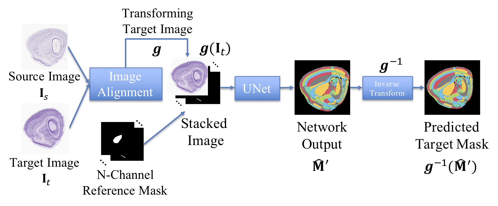
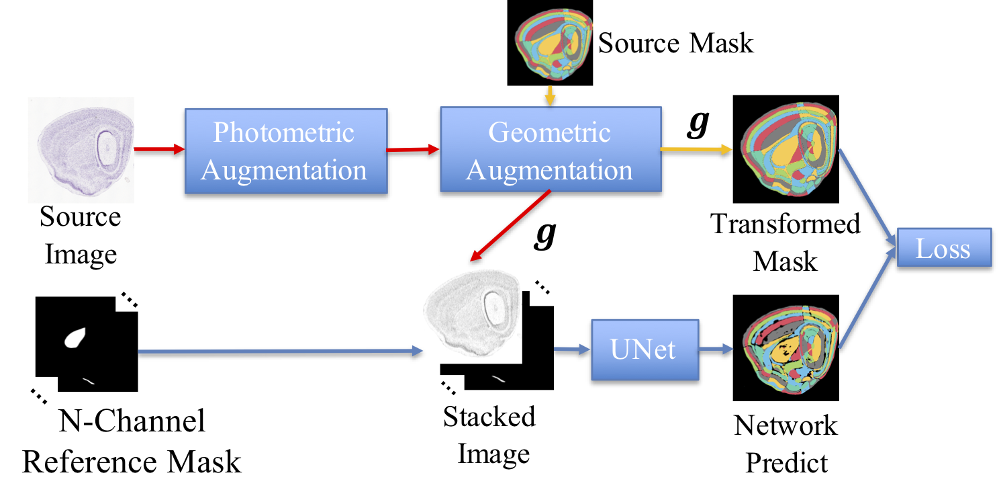
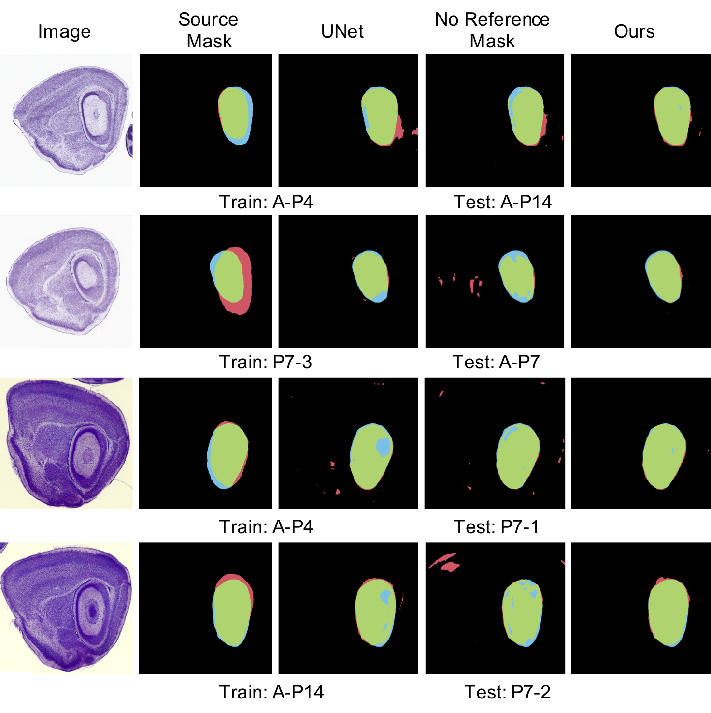
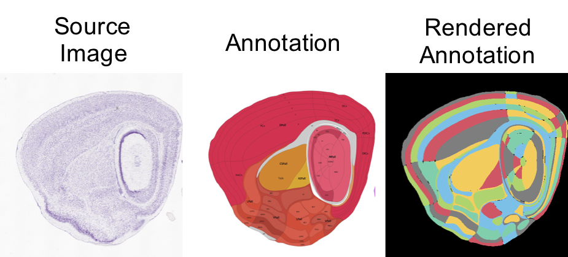
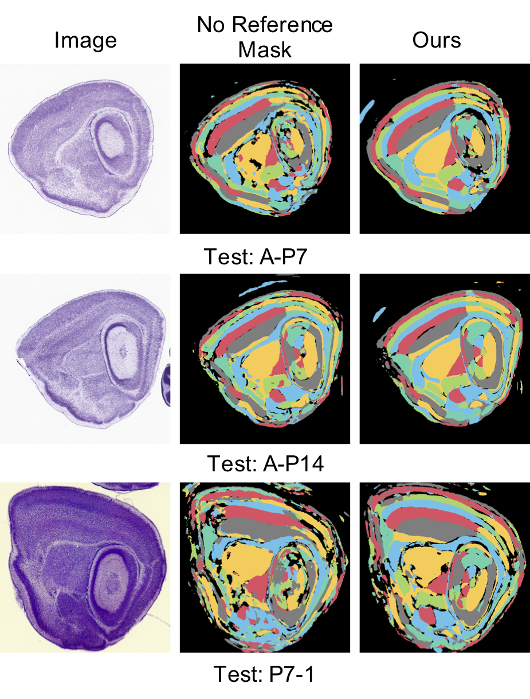

# One-Shot Brain Segmentation

Project page for One-shot Learning for Function-Specific Region Segmentation in Mouse Brain.

## Introduction

A brain contains a large number of structured regions responsible for diverse functions. Here we develop a one-shot learning approach to segment regions of mouse brains. Using the highly ordered geometry of brains, we introduce a reference mask to incorporate both the anatomical structure and the brain atlas into brain segmentation.

Here shows the pipeline of the proposed one-shot segmentation algorithm.

 

We first apply an [ECC based image alignment method](./code/align_image.py) to estimate a transform g(.) to align the target image to the source image. 

Due to the subject variation, a perfect alignment may be implausible.  We apply one  segmentation network (UNet [13]) to learn both the geometric and anatomical structures of each region in the source image and predict the segmentation result for the target images. To explicitly introduce the brain atlas into the network, we propose to use an N-channel reference mask whose i-th channel is a mask indicating the location and shape of the i-th function-specific region specified by the source mask. The reference mask helps the segmentation model understand the rough location and shape of each function-specific region. 

To efficiently learn the segmentation model with one training image, we proposed the following training pipeline.

 

Two types of data augmentation methods are applied to simulate the variations in target images via the source image: 1) Photometric augmentation, randomly changing the brightness, contrast and color of the source image; 2) Geometric augmentation, applying a random and minor geometric transformation to the source image to mimic the potential misalignment. The geometric augmentation is only applied to the source image not the reference mask to create the misalignment between them. The network is learned to predict the transformed mask (same transform as the source image) via the transformed image and the fixed reference mask. 

## Requirements

Please use Python 3.6, install OpenCV and additional libraries from requirements.txt

## Run the code

Download data[1] from 
[Google Drive](https://drive.google.com/open?id=16CB3sJiHnlrvrv9t6Cr-vgZjqOjck5sP). Unzip the data to ./data/

Run

```bash
cd code
```

To repeat the experiments for hippocampus region. The code run each training image for 10 times and take the average. It takes about 10 hours for all. Feel free to change the parameter in the file.  

```python
python run_multi_region_training.py
```

Final quantitative result is in ./final_result/. The detailed results and the qualitative result is in ./multi_region/. ./multi_region/unet_log/ is the training log. ./multi_region/result/ is the qualitative result. And ./multi_region/model/ is the model path.


To see the result for 95 regions. It takes about 5 hours for one training setting.

```python
python run_all_region_training.py
```


## Result and Discussion
We compare the proposed method with 3 baseline methods: 1) Source Mask (S.M.), directly regarding the source mask as output and using the inverse transformation g−1(·) to align the source mask back to the target image; 2) UNet, a model learned without image alignment nor reference mask (the conventional image segmentation setting); 3) UNet without reference mask (No Reference Mask), image alignment is applied to the target image, but the segmentation model is trained without the reference mask. Here shows some representative results.

 

When training without image alignment and the reference mask, the performance is even worse than directly using the source mask to predict. It shows that, for one-shot brain segmentation problem, since the number of training images is quite limited, the deep neural network does not perform well without the brain atlas. Simply aligning the test image to the training image improves the segmentation performance. The proposed method is the clear winner over all the other baseline methods.

Here shows the segmentation result of 95 detailed region using one single training image. The proposed algorithm shows clearly better result than model without reference mask.

 

 

## Citation

Please cite us if you use the code and the data:

```
@inproceedings{zhang2019oneshot,
title={One-shot Learning for Function-Specific Region Segmentation in Mouse Brain},
author={Zhang, Xu and Li, Zhuowei and Wang, Pei-Jie and Liao, Katelyn Y. and Chou, Shen-Ju and Chang, Shih-Fu and Liao, Jung-Chi},
booktitle={ISBI},
year={2019}
}
```

## Reference
[1] Allen Institute for Brain Science, “Allen developing mousebrain atlas,” Available from: http://developingmouse.brain-map.org, 2009.

## Acknowledgement
J.-C. Liao is supported by MOST, Taiwan 107-2918-I-001-004.


